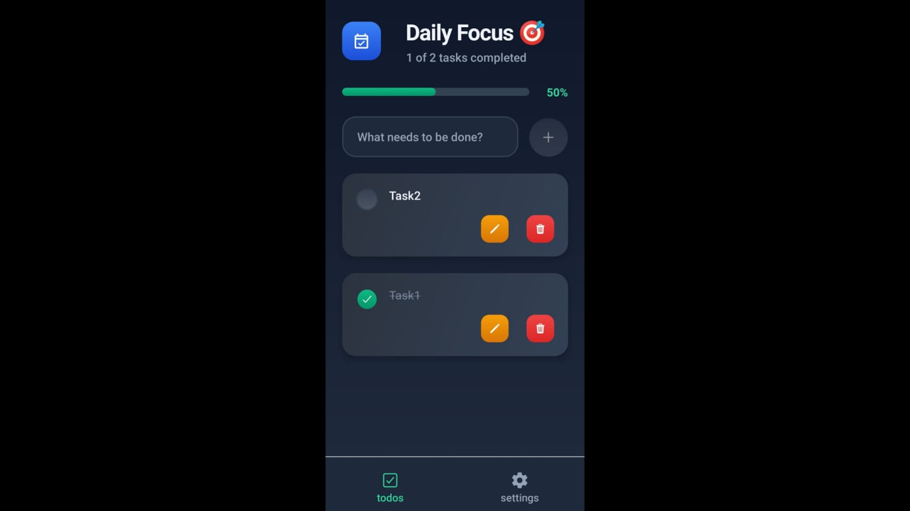

# 📋 React Native Todo App

A minimal and clean Todo application built using **React Native (with Expo)** and powered by **Convex** for real-time backend functionality.

## 🚀 Features
- ✅ Add, edit, and delete todos  
- 🔄 Real-time sync powered by Convex  
- 🧠 Persistent data (todos stay saved)  
- 📱 Works on Android (via APK build)  
- 💡 Simple, clean UI with smooth UX  
- 📦 Built with Expo and EAS Build  

## 📸 Preview


## 📲 APK Download
You can install the app on your Android device using the link below:

👉 [Download APK from Expo](https://expo.dev/accounts/rahul-dubey/projects/daily-planner/builds/e9e02da7-38cb-4739-a97e-983f4eba41e8) 
## 🛠️ Tech Stack
- **Frontend**: React Native (Expo)  
- **Backend**: Convex (Database + Functions)  
- **Build & Deployment**: EAS Build (APK)

## 📁 Project Structure
```
Todo-App/
├── app/               # Entry point routes and screens
├── assets/            # Images, fonts, and screenshots
├── components/        # Reusable UI components
├── convex/            # Convex backend logic
├── dist/              # (Optional) Distribution files
├── hooks/             # Custom React hooks
├── .env.local         # Environment variables (not committed)
├── app.config.js      # Expo app configuration
├── eas.json           # EAS build configuration
├── package.json       # NPM dependencies
├── README.md
└── ...
```

## ⚙️ Setup Locally
```bash
# 1. Clone the repository
git clone https://github.com/dubeyRahul26/Daily-Planner.git
cd todo-app

# 2. Install dependencies
npm install

# 3. Start the development server
npx expo start

# 4. (Optional) Run Convex backend locally
npx convex dev
```

## 🌐 Environment Variables
Create a `.env.local` file in the root and add:

```env
EXPO_PUBLIC_CONVEX_URL=https://moonlit-albatross-446.convex.cloud
```

✅ For production builds, ensure this URL points to your **production** Convex deployment.

## 🔧 Build APK Locally (Optional)
Make sure you’ve installed the EAS CLI globally:

```bash
npm install -g eas-cli
```

Then build the APK:

```bash
eas build -p android --profile preview
```

## 🙋‍♂️ Author
**Rahul Dubey**  
[LinkedIn](https://www.linkedin.com/in/rahul-dubey-dev/) • [GitHub](https://github.com/dubeyRahul26/)

⭐️ _Feel free to star the repo if you find it helpful!_
